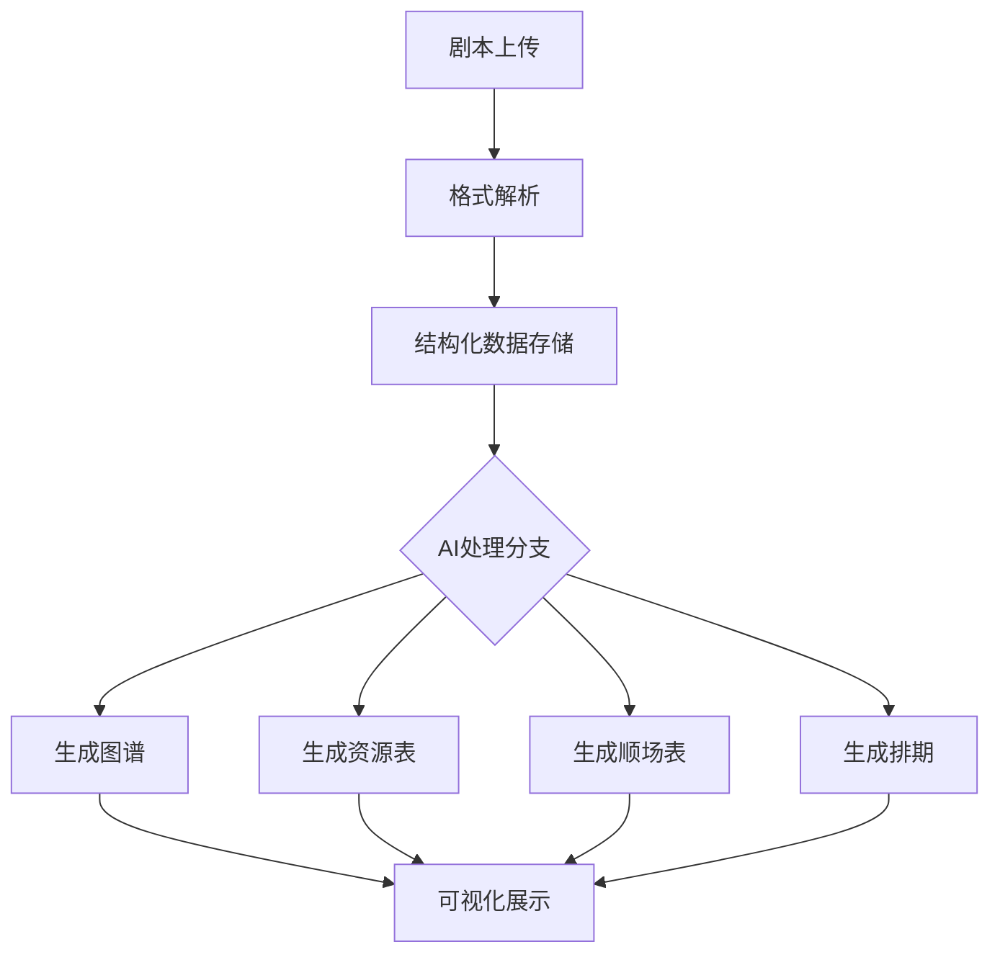
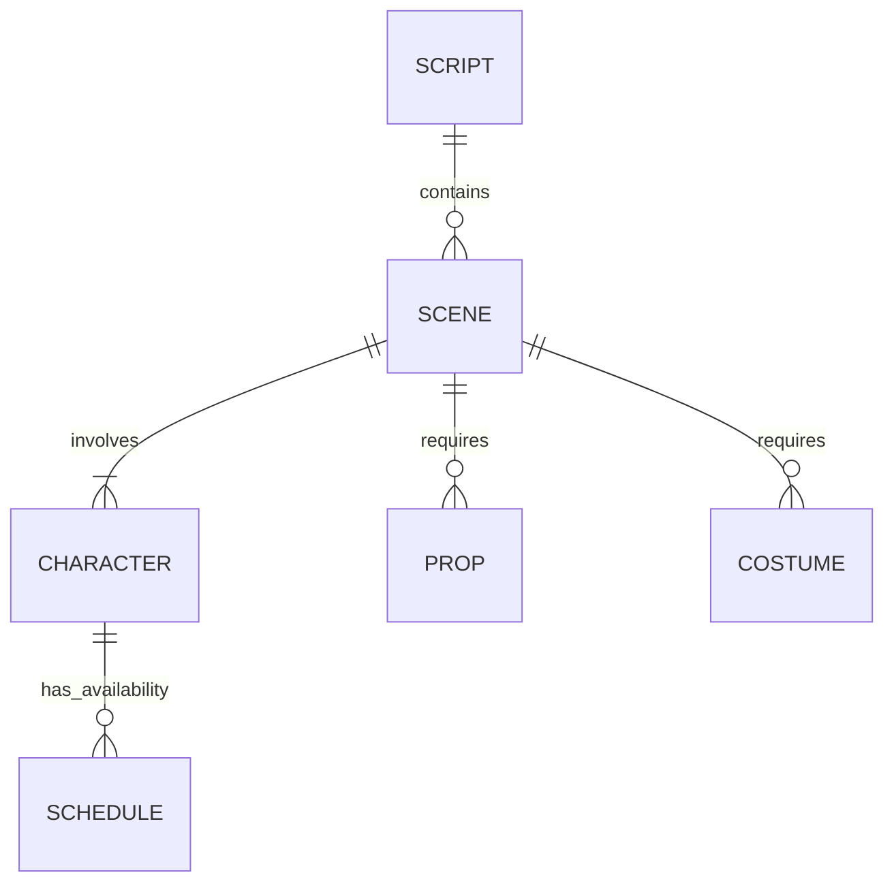

以下是一个完整的PRD文档（`prd.md`），基于您的需求设计了一个制片管理网站的核心功能和架构。您可以直接使用或根据实际需求调整：

```markdown
# 制片管理网站 PRD

## 1. 概述
### 1.1 产品目标
构建一个AI驱动的制片管理平台，通过剧本解析自动生成：
- 可视化故事图谱
- 服化道资源表格
- 专业顺场表
- 智能拍摄排期

### 1.2 目标用户
- 制片人
- 导演组
- 场记/统筹
- 美术/服装组

## 2. 核心功能
### 2.1 剧本解析引擎
#### 输入方式
- 文本直接输入
- PDF/Word文档上传
- Final Draft/Fountain格式导入

#### 解析输出
```json
{
  "scenes": [
    {
      "id": "S1",
      "location": "内景-客厅",
      "time": "日",
      "characters": ["张三", "李四"],
      "props": ["茶杯", "沙发"],
      "costumes": {
        "张三": "商务西装"
      }
    }
  ],
  "characters": {
    "张三": {
      "gender": "男",
      "age": "35",
      "costume_changes": 3
    }
  }
}
```

### 2.2 AI生成模块
#### 2.2.1 故事图谱
- 使用OpenAI GPT-4o生成：
  - 人物关系图（D3.js可视化）
  - 场景时空分布图
  - 情绪曲线分析

#### 2.2.2 资源表格
| 类型     | 元素       | 出现场次 | 备注                  |
|----------|------------|----------|-----------------------|
| 服装     | 红色礼服   | S1,S3    | 需准备2套备用         |
| 道具     | 古董怀表   | S2       | 需提前3天租赁        |
| 场景     | 医院走廊   | S5-S7    | 需夜间拍摄许可        |

#### 2.2.3 顺场表
```
场景  页数  内容概要                主要演员  特殊需求
S1    1.2  客厅争吵戏             张、李    需要雨声效果
S3    4.5  医院重逢               王、赵    需轮椅道具
```

#### 2.2.4 智能排期
- 基于以下因素自动排期：
  - 演员可用性（需手动录入）
  - 场景租赁周期
  - 天气因素（外景）
  - 制作复杂度（由AI评估）

### 2.3 协作功能
- 实时评论系统
- 版本对比工具
- 变更影响分析（如修改剧本自动提示受影响资源）

## 3. 技术架构
### 3.1 系统流程图


### 3.2 API集成
- OpenAI API调用流程：
  1. 预处理剧本结构
  2. 构建prompt模板（示例见附录）
  3. 流式接收处理结果
  4. 结果结构化校验

### 3.3 数据模型


## 4. 非功能性需求
### 4.1 性能指标
- 剧本解析 < 30秒（50页以内）
- AI生成响应 < 2分钟
- 支持10人同时协作编辑

### 4.2 安全要求
- 剧本内容AES-256加密存储
- 基于角色的访问控制（RBAC）
- 操作日志保留180天

## 5. 里程碑计划
| 阶段     | 周期   | 交付物                          |
|----------|--------|---------------------------------|
| 核心MVP  | 6周    | 剧本解析+基础表格生成           |
| 协作版   | 4周    | 实时协作+版本管理               |
| 智能优化 | 持续   | 排期优化算法改进                |

## 附录
### AI Prompt 示例
```python
prompt_template = """
你是一个专业制片助理，请分析以下剧本片段：
{script_segment}

请按以下结构输出：
1. 识别所有场景（INT/EXT）
2. 列出每个场景的：
   - 必需道具
   - 服装需求
   - 特殊效果
3. 评估场景复杂度（1-5星）
"""
```

### 成本估算
- OpenAI API：$0.12/剧本（平均）
- 存储成本：$20/月（初期）
- 服务器：$50/月（2核4G）
```

---